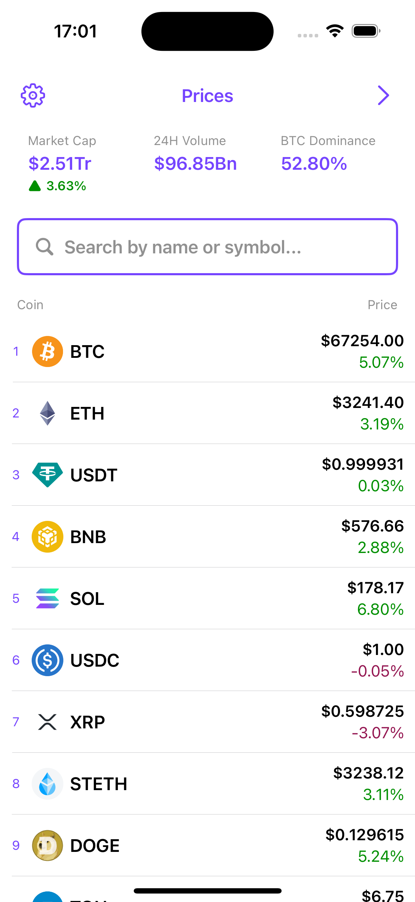
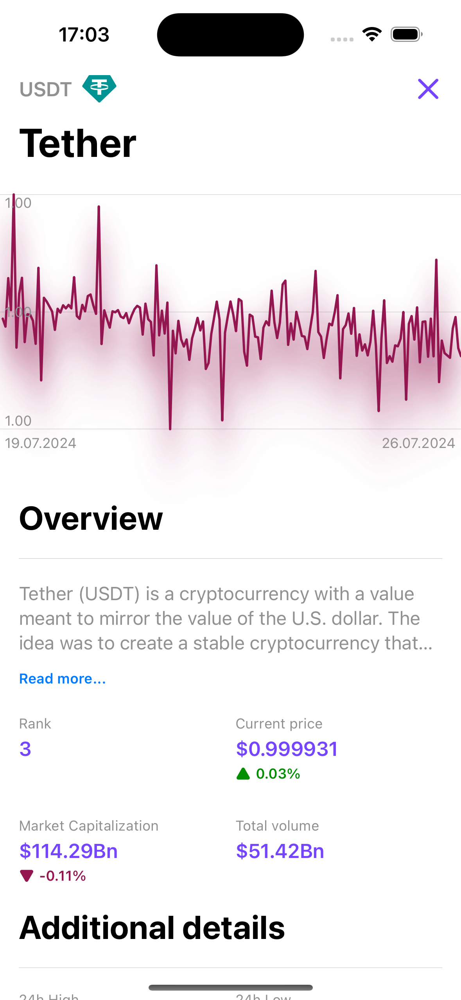
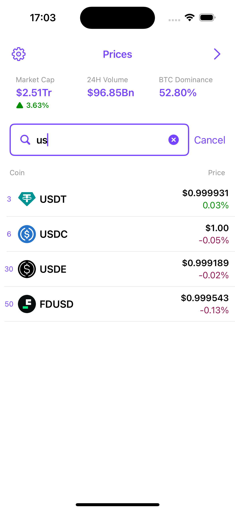
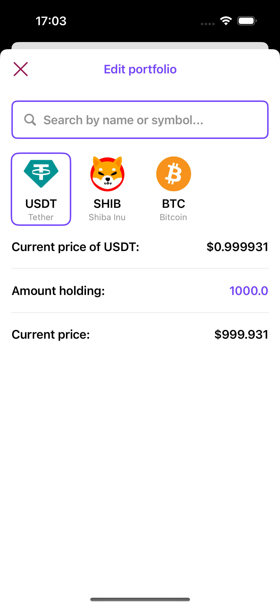

# Cryptos: cryptocurrency portfolio tracker 

### Stack
* iOS 15
* SwiftUI 3
* MVVM
* Async/await (structured concurrency)
* Network: URLSession + URLCache (caсhing network request for 15 min)
* Core Data for persisting user portfolio
* Dependencies: Swiftlint

### UI
 
 

### Demo
 

